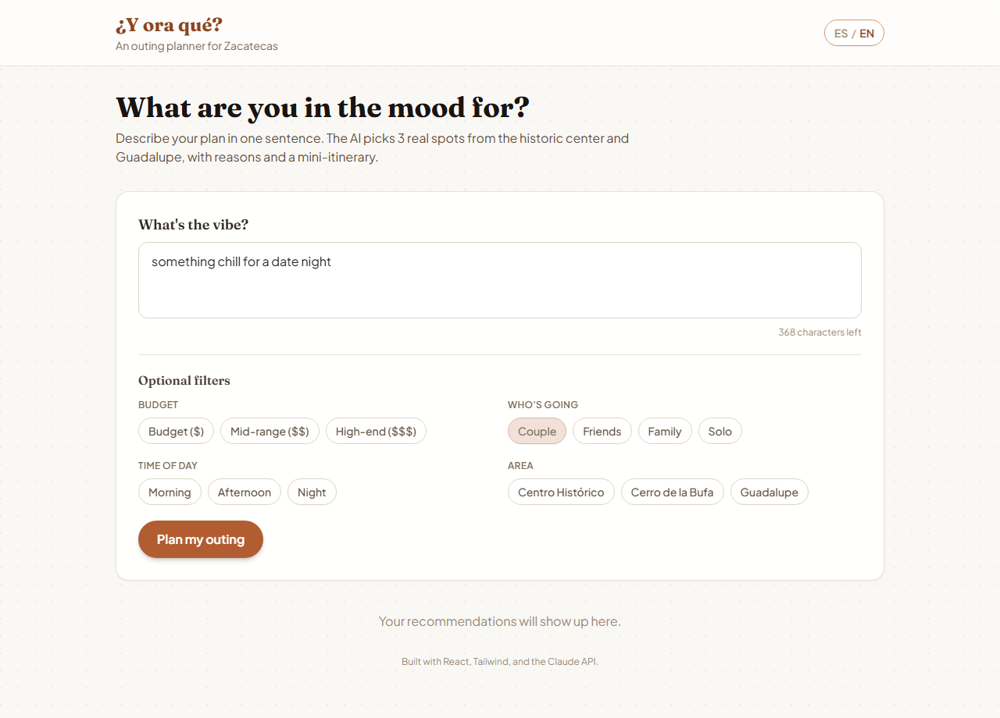

# ¿Y ora qué? 🌵

**A bilingual, AI-powered outing planner for Zacatecas, Mexico.** Built as a portfolio piece for an "AI-Native Web Developer" internship application.

**🔗 Live: [y-ora-que.vercel.app](https://y-ora-que.vercel.app)**

Describe what you feel like doing — *"something chill for a date,"* *"a cheap plan with friends on Saturday,"* *"showing my family around"* — add optional filters, and the app returns **3 real places** from a curated catalog of Zacatecas/Guadalupe venues, each with a short AI-written reason it fits and a suggested mini-itinerary (order + times).



## Why this project

This isn't a wrapper around a chatbot. The interesting engineering problem is **keeping an LLM honest inside a product**: it must *only* recommend real places from a fixed catalog, never invent one, and the app must degrade gracefully when the AI, the network, or the input misbehaves. That constraint shaped most of the technical decisions below.

## Stack

- **Frontend:** React + Vite + TypeScript, Tailwind CSS
- **Backend:** a single Vercel serverless function (`api/recommend.ts`) calling the **Anthropic API** via `@anthropic-ai/sdk`
- **Model:** `claude-sonnet-4-5` (one constant in `api/_lib/anthropic.ts` — bump the model in one place)
- **Deploy:** Vercel (static frontend + serverless function, zero extra config)

No database — the venue catalog is a static, hand-curated JSON file.

## How the AI pipeline works

This is the part most relevant to the role, so here's the full flow for a request:

```
User text + filters
      │
      ▼
1. CODE-SIDE FILTER (src/lib/filterVenues.ts)
   - Hard filters (budget, who's going, area) narrow the 26-venue catalog
   - A deterministic keyword scorer (no AI) ranks the rest by relevance
   - Falls back to the full catalog if filters leave zero matches
   - Result: ≤12 candidate venues — never the full catalog, never empty
      │
      ▼
2. LLM CALL (api/_lib/anthropic.ts)
   - Claude only ever sees the pre-filtered candidate list, not the whole catalog
   - Forced tool-use (tool_choice) makes Claude return structured JSON
     (venue_id, reason, suggested_time, order) instead of free text —
     no brittle "please respond in JSON" prompting or regex-parsing of prose
      │
      ▼
3. VALIDATION (src/lib/validate.ts)
   - Every returned venue_id is re-checked against the REAL catalog
   - Unknown/hallucinated ids are silently dropped
   - Duplicate ids are dropped, results capped at 3, sorted by suggested order
      │
      ▼
4. ERROR HANDLING (api/_lib/errors.ts)
   - Missing/invalid API key, rate limits, malformed tool output, and
     "AI returned 0 valid venues" each map to a distinct error code
   - The frontend turns each code into a friendly, localized (ES/EN) message
```

**Why forced tool-use instead of "respond with JSON"?** Asking a model to emit raw JSON in prose means parsing can fail in production for reasons that have nothing to do with the recommendation quality (a stray sentence before the `{`, markdown fences, etc). Anthropic's tool-use forces the model to fill a JSON Schema directly — the SDK gives you `tool_use.input` as an already-parsed object. It also doubles as free input validation: minItems/maxItems on the array, required fields per item, etc.

**Why filter in code before calling the LLM at all?** Three reasons: (1) cost/latency — don't ship a 26-venue catalog as tokens on every request, (2) it's a second, independent safety net against the model drifting outside the catalog — it's only ever shown ~12 valid candidates, (3) it keeps categoria/budget/area matching deterministic instead of trusting the model to apply a hard constraint correctly every time.

**Real-world cost:** tested live against the production deployment — each recommendation request (pre-filter + one `claude-sonnet-5` tool-use call) costs **about $0.01 USD**. That's the direct payoff of only ever sending ~12 pre-filtered candidates instead of the full catalog.

## Project structure

```
src/
  data/venues.json        # curated catalog — 26 real Zacatecas/Guadalupe venues
  lib/                     # shared, browser-safe logic (types, filtering, validation, catalog loader)
  i18n/                    # ES/EN dictionary + language context
  components/              # form, filters, result cards, loading/error states
  App.tsx
api/
  recommend.ts             # the Vercel serverless function (the only HTTP entry point)
  _lib/anthropic.ts        # Anthropic client, tool schema, prompt — SERVER ONLY, never bundled to the browser
  _lib/errors.ts           # maps SDK/validation errors to stable error codes
VERIFY.md                  # honest list of catalog facts (hours/prices) that still need a manual check
```

`api/_lib` is deliberately **outside** `src/`, which Vite bundles for the browser. The Anthropic SDK and `process.env.ANTHROPIC_API_KEY` never enter the frontend build — the key only ever exists inside the serverless function's Node runtime.

## The venue catalog

`src/data/venues.json` has 26 real, named places across the historic center of Zacatecas and the Guadalupe municipality — the cable car (Teleférico), Cerro de la Bufa, Mina El Edén, the Cathedral, several museums (Rafael Coronel, Pedro Coronel, Goitia, Zacatecano), the González Ortega market, well-known restaurants/cafés/bars, parks, and plazas. No place was invented.

What's **not** independently verified against a live source today: exact opening hours and peso prices, which change over time. Every venue has a `verificar` object flagging which of its fields are uncertain, and [`VERIFY.md`](VERIFY.md) lists exactly what to double-check by hand before treating this as production data.

## Running it locally

```bash
npm install
cp .env.example .env        # then paste your real key into .env
npm run dev                 # frontend only, at http://localhost:5173
```

To exercise the actual serverless function the way Vercel runs it in production:

```bash
npm install -g vercel        # one-time
vercel login                 # one-time, opens a browser
vercel dev                   # serves frontend + /api together
```

`vercel dev` needs you to be logged in to a Vercel account (even just to emulate locally) — `npm run dev` alone is enough to work on the UI, but requests to `/api/recommend` will 404 under plain Vite since that function only runs under Node/Vercel's runtime.

## Deploying to Vercel

1. **Push to GitHub**
   ```bash
   git init
   git add .
   git commit -m "Initial commit"
   git branch -M main
   git remote add origin https://github.com/<your-username>/y-ora-que.git
   git push -u origin main
   ```
2. **Import into Vercel**
   - Go to [vercel.com/new](https://vercel.com/new), select the GitHub repo.
   - Framework preset: Vite (auto-detected). No build command changes needed.
3. **Add the environment variable**
   - In the project's **Settings → Environment Variables**, add `ANTHROPIC_API_KEY` with your real key, for the Production (and Preview, if you want PR previews to work) environments.
4. **Deploy** — Vercel builds `npm run build` for the static frontend and auto-detects `api/recommend.ts` as a serverless function. No `vercel.json` required.
5. Visit the generated `*.vercel.app` URL and confirm a real request returns recommendations (not just that the page loads — the API key only exists in production once step 3 is done).

## Error handling you can actually trigger

- **No API key configured** → friendly "AI service isn't configured" message, not a stack trace.
- **Anthropic rate limit (429)** → "we're getting a lot of requests, try again."
- **Malformed/empty tool response from Claude** → "unexpected response, try again," never a blank screen.
- **All returned ids invalid** → explicit "no valid recommendations" state instead of silently showing garbage.

## What I'd do next with more time

- Cache repeated prompts (same text + filters) for a few minutes to cut latency/cost.
- Add a few automated tests around `filterVenues`/`validate` (currently verified manually with ad-hoc scripts during development, not checked into the repo).
- Expand the catalog past the historic center (e.g. more of Guadalupe, nearby pueblos mágicos).
